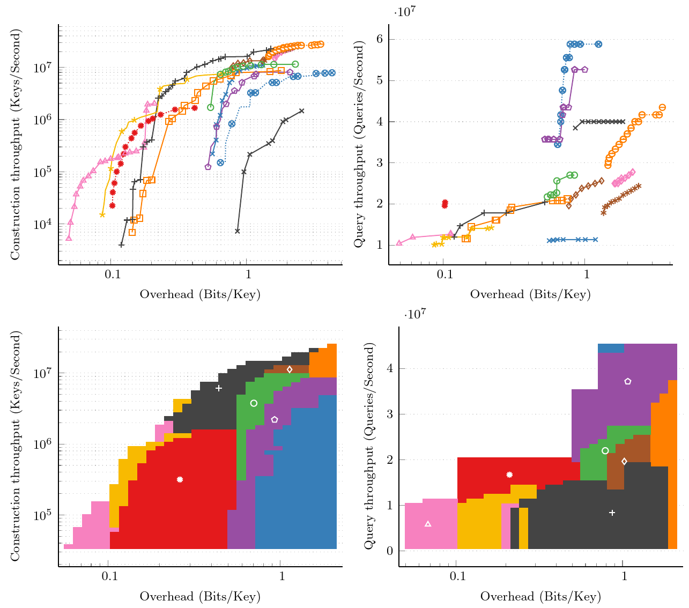

# MPHF-Experiments

Comparison of a wide range different minimal perfect hash functions (MPHFs).
From these, it can generate comprehensive plots like Pareto plots, and simple comparison tables used in several papers.



The framework provides a unified interface to test basically all modern MPHF constructions that are currently available, including:

- Bucket Placement
  - CHD ([Paper](https://doi.org/10.1007/978-3-642-04128-0_61), [Code](https://cmph.sourceforge.net/))
  - PHOBIC ([Paper](https://doi.org/10.4230/LIPIcs.ESA.2024.69), [Code](https://github.com/jermp/pthash))
  - FCH ([Paper](https://doi.org/10.1145/133160.133209), [Code](https://cmph.sourceforge.net/))
  - FCH (Re-Implementation by Pibiri) ([Code](https://github.com/roberto-trani/mphf_benchmark/blob/main/include/fch.hpp))
  - PHOBIC-GPU ([Paper](https://doi.org/10.4230/LIPIcs.ESA.2024.69), [Code](https://github.com/stefanfred/PHOBIC-GPU))
  - PTHash ([Paper](https://doi.org/10.1145/3404835.3462849), [Code](https://github.com/jermp/pthash))
  - PTHash-HEM ([Paper](https://doi.org/10.1109/TKDE.2023.3303341), [Code](https://github.com/jermp/pthash))
  - PHast (Not published yet) ([Code](https://github.com/beling/bsuccinct-rs/))
  - PtrHash ([Paper](https://doi.org/10.48550/ARXIV.2502.15539), [Code](https://github.com/RagnarGrootKoerkamp/PTRHash))
- Consensus
  - Consensus-RS ([Paper](https://doi.org/10.48550/ARXIV.2502.05613), [Code](https://github.com/ByteHamster/ConsensusRecSplit/))
- Fingerprinting
  - BBHash ([Paper](https://doi.org/10.4230/LIPICS.SEA.2017.25), [Code](https://github.com/rizkg/BBHash))
  - FiPS ([Paper](https://doi.org/10.5445/IR/1000176432), [Code](https://github.com/ByteHamster/FiPS))
  - FMPH ([Paper](https://doi.org/10.1145/3596453), [Code](https://github.com/beling/bsuccinct-rs/))
  - FMPH-GO ([Paper](https://doi.org/10.1145/3596453), [Code](https://github.com/beling/bsuccinct-rs/))
- RecSplit
  - RecSplit ([Paper](https://doi.org/10.1137/1.9781611976007.14), [Code](https://github.com/vigna/sux/blob/master/sux/function/RecSplit.hpp))
  - GpuRecSplit ([Paper](https://doi.org/10.4230/LIPICS.ESA.2023.19), [Code](https://github.com/ByteHamster/GpuRecSplit))
  - SIMDRecSplit, RecSplit with rotation fitting ([Paper](https://doi.org/10.4230/LIPICS.ESA.2023.19), [Code](https://github.com/ByteHamster/GpuRecSplit))
- Retrieval
  - BDZ / BPZ ([Paper](https://doi.org/10.1145/1321440.1321532), [Code](https://cmph.sourceforge.net/))
  - BMZ ([Paper](https://www.researchgate.net/publication/228715398_A_new_algorithm_for_constructing_minimal_perfect_hash_functions), [Code](https://cmph.sourceforge.net/))
  - CHM ([Paper](https://doi.org/10.1016/0020-0190\(92\)90220-P), [Code](https://cmph.sourceforge.net/))
  - WBPM ([Paper](https://doi.org/10.1609/AAAI.V34I02.5529), [Code](https://github.com/weaversa/MPHF-WBPM))
  - SicHash ([Paper](https://doi.org/10.1137/1.9781611977561.CH15), [Code](https://github.com/ByteHamster/SicHash))
- ShockHash
  - ShockHash (+ SIMD version) ([Paper](https://doi.org/10.1137/1.9781611977929.15), [Code](https://github.com/ByteHamster/ShockHash))
  - Bipartite ShockHash ([Paper](https://doi.org/10.48550/ARXIV.2310.14959), [Code](https://github.com/ByteHamster/ShockHash))
  - Bipartite ShockHash-Flat ([Paper](https://doi.org/10.48550/ARXIV.2310.14959), [Code](https://github.com/ByteHamster/ShockHash))
  - MorphisHash ([Paper](https://doi.org/10.48550/ARXIV.2503.10161), [Code](https://github.com/stefanfred/MorphisHash))
  - MorphisHash-Flat ([Paper](https://doi.org/10.48550/ARXIV.2503.10161), [Code](https://github.com/stefanfred/MorphisHash))

### Cloning the Repository

This repository contains submodules.
To clone the repository including submodules, use the following command.

```
git clone --recursive https://github.com/ByteHamster/MPHF-Experiments.git
```

### Running the Experiments Directly

Compiling works like with every cmake project.

```
cmake -B ./build -DCMAKE_BUILD_TYPE=Release
cmake --build ./build -j
```

This might take about 5-15 minutes because of the large number of competitors.
You can then run one of the benchmarks, for example `./build/TablePtrHash --help` or `./build/Comparison --help`.

### Code Structure

The main comparison code can be found in the [`src` directory](/src).
This includes tabular comparisons like they are used in different papers, as well as the more general Pareto plot in [`src/Comparison.cpp`](/src/Comparison.cpp).
To add a new competitor to the framework, have a look at the [`contenders` directory](/contenders).
For each contender, there are two files. (1) A general wrapper header class that unifies the interface of the competitor, and (2) a cpp file that tests a wide range of configurations for the general Pareto plot.
The cpp file should contain all meaningful configurations to cover all possible trade-offs.
After adding a contender, make sure to re-run cmake.
If you want to add a new comparison table, make sure to also adapt the [`CMakeLists.txt` file](/CMakeLists.txt) accordingly.

### Running the Experiments with Docker

For easier reproducibility and less setup overhead, we provide a docker image to run the experiments.
However, for the measurements in the papers, we run the code directly and with more data points.
We refer to [Docker.md](/Docker.md) for details on how to use this repository with Docker.

### License

This code is licensed under the [GPLv3](/LICENSE).
