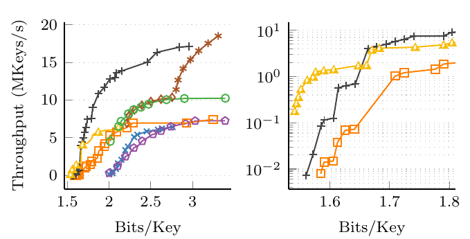

# MPHF-Experiments

Comparison of different minimal perfect hash functions (MPHFs).

### Cloning the Repository

This repository contains submodules.
To clone the repository including submodules, use the following command.

```
git clone --recursive https://github.com/ByteHamster/MPHF-Experiments.git
```

### Reproducing Experiments

This repository contains the source code and our reproducibility artifacts for our paper.
Due to the plethora of dependencies required by our competitors, we provide an easy to use Docker image to quickly reproduce our results.
Alternatively, you can look at the `Dockerfile` to see all libraries, tools, and commands necessary to compile the different competitors.

#### Building the Docker Image

For easier reproducibility, we also provide a docker image to run the experiments.
However, for the measurements in the papers, we run the code directly and with more data points.
Run the following command to build the Docker image.
Building the image takes about 10 minutes, as some packages (including LaTeX for the plots) have to be installed.
Note that your machine needs to support the AVX2 instruction set extension to successfully run the experiments.

```bash
docker build -t mphf_experiments --no-cache .
```

Some compiler warnings (red) are expected when building competitors and will not prevent building the image or running the experiments.
Please ignore them!

#### Running the Experiments
Due to the long total running time of all experiments in our paper, we provide run scripts for a slightly simplified version of the experiments.
They run fewer iterations and output fewer data points.

You can modify the benchmarks scripts in `scripts/dockerVolume` if you want to change the number of runs or data points.
This does not require the Docker image to recompile.
Different experiments can be started by using the following command:

```bash
docker run --interactive --tty -v "$(pwd)/scripts/dockerVolume:/opt/dockerVolume" mphf_experiments /opt/dockerVolume/<script>.sh
```

`<script>` depends on the experiment you want to run.

| Figure                                                                                                                        | Launch command                      | Estimated runtime  |
| :---------------------------------------------------------------------------------------------------------------------------- | :---------------------------------- | :----------------- |
| [SicHash](https://doi.org/10.1137/1.9781611977561.ch15), Figure 6 <br /> | /opt/dockerVolume/comparison-N.sh   | 20 minutes         |
| [SicHash](https://doi.org/10.1137/1.9781611977561.ch15), Figure 8 <br /> | /opt/dockerVolume/pareto.sh         | 45 minutes         |
| [GpuRecSplit](https://arxiv.org/pdf/2212.09562.pdf), Figure 6 <br /> | /opt/dockerVolume/pareto-threads.sh | 45 minutes         |
| [ShockHash](https://arxiv.org/pdf/2308.09561v1), Figure 5 <br />       | /opt/dockerVolume/pareto-zoomed.sh  | 60 minutes         |
| [Dominance Maps](https://publikationen.bibliothek.kit.edu/1000176432), Figure 8 <br /> | /opt/dockerVolume/dominance-map.sh  | 4 hours |

The resulting plots can be found in `scripts/dockerVolume` and have the file extension `.pdf`.
Note again that the scripts in `scripts/dockerVolume` are simplified versions of the experiments.
We give the full scripts in the `scripts` folder.

### License

This code is licensed under the [GPLv3](/LICENSE).
